# FinBridge — Complete End-to-End Project Documentation

> **Version**: Final20 | **Generated**: June 2026
> **Architecture**: React 19 + Vite 8 (Frontend) ⟷ Spring Boot 3.2.5 + PostgreSQL/Supabase (Backend)

---

## Table of Contents

1. [Project Overview](#1-project-overview)
2. [Complete Folder Structure](#2-complete-folder-structure)
3. [Complete User Journey Flow](#3-complete-user-journey-flow)
4. [Button Click Analysis](#4-button-click-analysis)
5. [Complete Frontend Flow](#5-complete-frontend-flow)
6. [Complete Backend Flow](#6-complete-backend-flow)
7. [Database Analysis](#7-database-analysis)
8. [Authentication Flow](#8-authentication-flow)
9. [Role-Based Access Flow](#9-role-based-access-flow)
10. [API Flow Mapping](#10-api-flow-mapping)
11. [Form Submission Flow](#11-form-submission-flow)
12. [State Management Analysis](#12-state-management-analysis)
13. [Error Handling Flow](#13-error-handling-flow)
14. [Complete FinBridge Business Workflow](#14-complete-finbridge-business-workflow)
15. [Sequence Diagrams](#15-sequence-diagrams)
16. [Function Analysis](#16-function-analysis)
17. [Dependency Analysis](#17-dependency-analysis)
18. [Complete Data Flow](#18-complete-data-flow)
19. [Security Analysis](#19-security-analysis)
20. [System Architecture](#20-system-architecture)
21. [Project Execution Flow](#21-project-execution-flow)
22. [Interview Preparation Guide](#22-interview-preparation-guide)
23. [Project Story Mode](#23-project-story-mode)
24. [Bugs, Risks & Improvements](#24-bugs-risks--improvements)

---

## 1. Project Overview

| Attribute | Value |
|---|---|
| **Project Name** | FinBridge |
| **Purpose** | Enterprise Financial Advisory CRM + B2B Client Portal |
| **Business Objective** | Connect visitors → leads → qualified clients → consultants, manage loans/tax/investments/insurance/wealth workflows end-to-end |
| **Target Users** | Super Admins, CRM Admins, Department Admins, Consultants, B2B Organization Clients, Public Website Visitors |
| **Frontend** | React 19 + Vite 8 + TailwindCSS 4 + Framer Motion + Recharts + Lucide Icons |
| **Backend** | Spring Boot 3.2.5 (Java 21) + Spring Security + Spring Data JPA |
| **Database** | PostgreSQL (Supabase hosted), Flyway migrations |
| **Authentication** | JWT (HMAC-SHA256) — dual session system (CRM token + B2B token) |
| **APIs** | RESTful JSON over HTTPS, documented via SpringDoc OpenAPI/Swagger |
| **Third-Party Services** | Supabase (DB hosting), Gmail SMTP (emails), Razorpay (payment gateway — mock mode) |
| **Deployment** | Spring Boot JAR on port 5000 + Vite dev server on port 5173 |

### Tech Stack Diagram

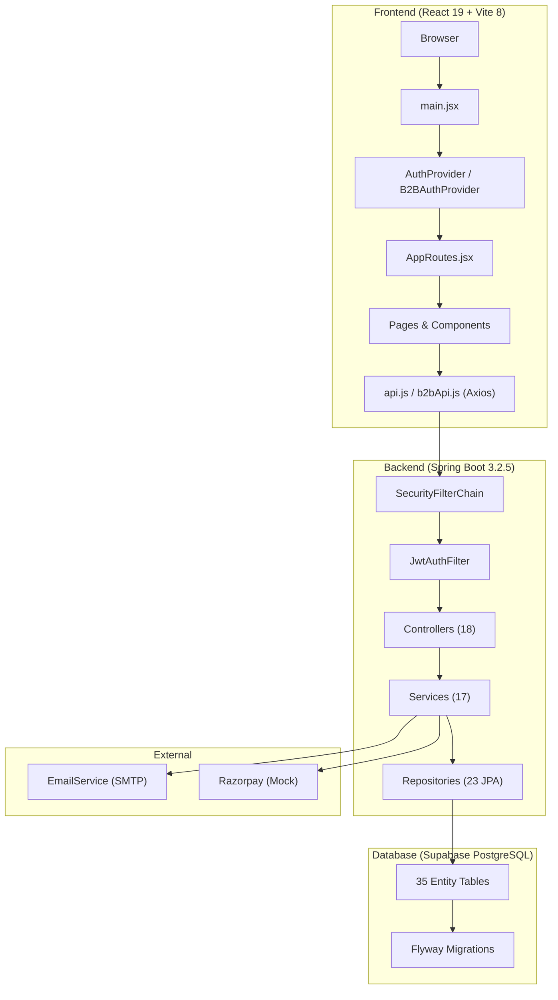

---

## 2. Complete Folder Structure

### 2.1 Root Structure

```
FinBridge_Final20/
├── backend-springboot/          # Java Spring Boot backend
├── frontend/                    # React + Vite frontend
├── memory/                      # Agent memory files
├── scratch/                     # One-off scripts (DB patches, etc.)
├── .github/                     # CI/CD workflows
├── .gitignore
└── README.md
```

### 2.2 Backend: `backend-springboot/`

```
backend-springboot/
├── pom.xml                                  # Maven config (Spring Boot 3.2.5, Java 21)
├── start.bat                                # Windows startup script
└── src/main/
    ├── java/com/finbridge/
    │   ├── FinBridgeApplication.java        # @SpringBootApplication entry point
    │   ├── config/
    │   │   ├── SecurityConfig.java          # CORS, CSRF, JWT filter chain, public endpoints
    │   │   ├── JacksonConfig.java           # Hibernate lazy-proxy serialization fix
    │   │   └── SwaggerConfig.java           # OpenAPI/Swagger UI config
    │   ├── controller/                      # 18 REST controllers
    │   │   ├── AuthController.java          # /api/auth — login, register, email verify, password reset, user CRUD
    │   │   ├── B2BController.java           # /api/b2b — organization portal (register, login, service requests, proposals, meetings, payments, documents, team, support)
    │   │   ├── LeadController.java          # /api/leads — CRM lead capture, filtering, conversion
    │   │   ├── ConsultationController.java  # /api/consultations — booking, scheduling, accepting, completing
    │   │   ├── LoanCaseController.java      # /api/loan-cases — loan workflow (eligibility → disbursement → EMI)
    │   │   ├── DeptCaseController.java      # /api/dept-cases — tax/investment/insurance/wealth workflow
    │   │   ├── ProposalController.java      # /api/proposals — create, update, client decision
    │   │   ├── InvoiceController.java       # /api/invoices — create, status update, revenue stats
    │   │   ├── PaymentController.java       # /api/payments — record payments, stats
    │   │   ├── KycController.java           # /api/kyc — document review queue, verify/reject
    │   │   ├── DashboardController.java     # /api/dashboard — aggregate stats
    │   │   ├── NotificationController.java  # /api/notifications — list, mark read
    │   │   ├── FinancialProfileController.java # /api/financial-profile — client financial data
    │   │   ├── ChatController.java          # /api/chat — internal messaging system
    │   │   ├── DocumentController.java      # /api/documents — document management
    │   │   ├── InvestmentController.java    # /api/investments — investment CRUD
    │   │   ├── LoanController.java          # /api/loans — legacy loan endpoints
    │   │   └── HealthController.java        # /api/health — health check
    │   ├── service/                         # 17 business logic services
    │   │   ├── AuthService.java             # Registration, login, email verify, password reset
    │   │   ├── B2BService.java              # Organization portal business logic (36KB — largest service)
    │   │   ├── LeadService.java             # Lead lifecycle, scoring, conversion, department routing
    │   │   ├── ConsultationService.java     # Consultation scheduling, completion, payment tracking
    │   │   ├── LoanCaseService.java         # Loan stages: doc collection → eligibility → recommendation → bank → disbursement → EMI
    │   │   ├── DeptCaseService.java         # Generic department case workflows (JSONB-driven)
    │   │   ├── ProposalService.java         # Proposal creation, client approval flow
    │   │   ├── InvoiceService.java          # Invoice generation, tax calculation, revenue stats
    │   │   ├── PaymentService.java          # Payment recording, invoice settlement
    │   │   ├── KycService.java              # KYC document verification queue
    │   │   ├── DocumentService.java         # Document storage/retrieval
    │   │   ├── InvestmentService.java       # Investment CRUD operations
    │   │   ├── LoanService.java             # Legacy loan operations
    │   │   ├── UserService.java             # User CRUD, role filtering
    │   │   ├── NotificationService.java     # In-app notification creation/delivery
    │   │   ├── EmailService.java            # SMTP email sending (async)
    │   │   ├── SequenceGenerator.java       # Auto-incrementing IDs (LEAD-001, CASE-001, INV-001)
    │   │   └── email/                       # Email template helpers
    │   ├── entity/                          # 35 JPA entity classes
    │   │   ├── User.java                    # Core user (implements UserDetails)
    │   │   ├── Lead.java                    # CRM lead with scoring and notes
    │   │   ├── Organization.java            # B2B company entity
    │   │   ├── OrganizationUser.java        # B2B portal login user
    │   │   ├── LoanCase.java                # Full loan workflow state machine
    │   │   ├── DeptCase.java                # Generic dept workflow (JSONB data)
    │   │   ├── Consultation.java            # Meeting/consultation booking
    │   │   ├── Proposal.java                # Service proposals with JSONB details
    │   │   ├── Invoice.java                 # Billing invoices with line items
    │   │   ├── Payment.java                 # Payment gateway records
    │   │   ├── FinancialProfile.java        # Client financial data
    │   │   ├── Notification.java            # In-app notifications
    │   │   ├── ChatMessage.java             # Internal chat messages
    │   │   ├── ... (20+ more entities)
    │   │   └── BaseEntity.java              # Shared ID + timestamps
    │   ├── dto/                             # 32 Data Transfer Objects
    │   │   ├── LoginRequest/Response         # Auth DTOs
    │   │   ├── RegisterRequest.java          # Registration payload
    │   │   ├── LeadRequest/Response          # Lead DTOs
    │   │   ├── ProposalRequest/Response      # Proposal DTOs
    │   │   ├── InvoiceRequest/Response       # Invoice DTOs
    │   │   ├── LoanCaseResponse.java         # Loan case flattened DTO
    │   │   ├── OrgRegisterRequest.java       # B2B registration (company details)
    │   │   ├── OrgLoginRequest/Response      # B2B auth DTOs
    │   │   ├── DtoMapper.java                # Central entity→DTO mapper
    │   │   └── ... (20+ more DTOs)
    │   ├── repository/                      # 23 Spring Data JPA repositories
    │   │   ├── UserRepository.java           # findByEmail, role-based queries
    │   │   ├── LeadRepository.java           # Status/department filtering, stats
    │   │   ├── OrganizationRepository.java   # Company lookup
    │   │   ├── LoanCaseRepository.java       # Client/consultant loan queries
    │   │   ├── ConsultationRepository.java   # Department/consultant filtering
    │   │   ├── ProposalRepository.java       # Multi-criteria proposal queries
    │   │   ├── InvoiceRepository.java        # Revenue calculations
    │   │   ├── PaymentRepository.java        # Payment tracking
    │   │   └── ... (15+ more repositories)
    │   ├── security/                        # Security infrastructure
    │   │   ├── JwtService.java              # JWT generation (CRM + B2B + Purpose tokens)
    │   │   ├── JwtAuthFilter.java           # OncePerRequestFilter — extracts JWT, sets SecurityContext
    │   │   ├── SecurityRoles.java           # @PreAuthorize SpEL constants (STAFF, ADMINS, ADMIN_OR_DEPT)
    │   │   ├── B2BAccessGuard.java          # Organization ownership validation
    │   │   ├── OwnershipGuard.java          # Resource ownership validation
    │   │   └── RateLimitFilter.java         # IP-based rate limiting
    │   └── exception/                       # Error handling
    │       ├── GlobalExceptionHandler.java  # @RestControllerAdvice — maps exceptions to HTTP responses
    │       ├── BadRequestException.java     # 400
    │       ├── ResourceNotFoundException.java # 404
    │       └── UnauthorizedException.java   # 401
    └── resources/
        ├── application.yml                  # Main config (DB, JWT, CORS, mail, Flyway)
        ├── application-dev.yml              # Dev profile overrides
        └── db/migration/                    # Flyway SQL migrations
```

### 2.3 Frontend: `frontend/`

```
frontend/
├── index.html                               # SPA entry point
├── package.json                             # Dependencies & scripts
├── vite.config.js                           # Vite build config
├── .env                                     # VITE_API_URL
└── src/
    ├── main.jsx                             # React root: BrowserRouter → AuthProvider → B2BAuthProvider → App
    ├── App.jsx                              # Scroll-to-top + renders AppRoutes
    ├── index.css                            # Global styles & Tailwind import
    ├── App.css                              # App-level styles
    ├── routes/
    │   └── AppRoutes.jsx                    # ALL routes (402 lines, 80+ routes)
    ├── context/
    │   ├── AuthContext.jsx                  # CRM auth state (login/logout/register, token in session+local storage)
    │   └── B2BAuthContext.jsx               # B2B org auth state (separate session)
    ├── services/
    │   ├── api.js                           # Axios instance for CRM (auto JWT, Spring Page unwrap, _id alias)
    │   └── b2bApi.js                        # Axios instance for B2B (separate token, auto-logout on 401)
    ├── components/                          # 34 shared components
    │   ├── Navbar/                           # Main site navigation
    │   ├── Footer.jsx                        # Site footer
    │   ├── Sidebar.jsx                       # Admin/consultant dashboard sidebar
    │   ├── Topbar.jsx                        # Dashboard top navigation bar
    │   ├── Chatbot.jsx                       # AI chatbot widget (frontend-only)
    │   ├── LeadCaptureForm.jsx               # Public lead capture form (20KB)
    │   ├── ProtectedRoute.jsx                # Auth guard — redirects to role-specific login
    │   ├── RoleBasedRoute.jsx                # Role + department guard
    │   ├── B2BProtectedRoute.jsx             # B2B session guard
    │   ├── FinancialProfileGuard.jsx         # Ensures client has financial profile
    │   ├── ErrorBoundary.jsx                 # React error boundary
    │   ├── ThreeBackground.jsx               # WebGL animated background
    │   ├── CustomCursor.jsx                  # Custom cursor effect
    │   ├── CookieConsent.jsx                 # GDPR cookie banner
    │   ├── WorkflowOverview.jsx              # Visual workflow stepper
    │   ├── CrossSellEngine.jsx               # Service recommendation engine
    │   ├── KPICard.jsx                       # Dashboard metric cards
    │   ├── StatusBadge.jsx                    # Status indicator component
    │   ├── DataTable.jsx                      # Reusable data table
    │   ├── Timeline.jsx                       # Activity timeline
    │   ├── PageHeader.jsx                     # Page header with breadcrumbs
    │   ├── EmptyState.jsx                     # Empty data placeholder
    │   ├── Loader.jsx                         # Loading spinner
    │   └── AnimatedCounter.jsx                # Animated number counter
    ├── layouts/                             # 7 layout wrappers
    │   ├── MainLayout.jsx                    # Public website layout
    │   ├── AdminLayout.jsx                   # Super admin dashboard layout (Sidebar+Topbar)
    │   ├── CRMAdminLayout.jsx                # CRM admin layout
    │   ├── DepartmentAdminLayout.jsx         # Department admin layout
    │   ├── ConsultantLayout.jsx              # Consultant layout
    │   ├── ClientLayout.jsx                  # Client layout
    │   └── B2BLayout.jsx                     # B2B organization portal layout
    ├── pages/                               # 10 page groups
    │   ├── website/                          # Public marketing pages
    │   │   ├── Home/Home.jsx                  # Landing page (80KB — largest component)
    │   │   ├── About/About.jsx                # About page
    │   │   ├── Contact/Contact.jsx            # Contact form page
    │   │   ├── Services/                      # 10 service pages (Valuation, Tax, Wealth, etc.)
    │   │   ├── Industries/                    # Market intelligence page
    │   │   └── Legal/                         # Privacy, Terms, Regulatory
    │   ├── public/                           # Auth & public functional pages
    │   │   ├── LoginRegistration.jsx          # Unified login/register (26KB)
    │   │   ├── AdminLogin.jsx                 # Super admin login
    │   │   ├── CRMAdminLogin.jsx              # CRM admin login
    │   │   ├── DepartmentAdminLogin.jsx       # Department admin login
    │   │   ├── ConsultantLogin.jsx            # Consultant login
    │   │   ├── ForgotPassword.jsx             # Password reset request
    │   │   ├── ResetPassword.jsx              # Password reset form
    │   │   ├── VerifyEmail.jsx                # Email verification
    │   │   ├── LandingPage.jsx                # Pricing landing page
    │   │   ├── OnboardingAssessment.jsx       # New client onboarding
    │   │   └── NotFound.jsx                   # 404 page
    │   ├── admin/                            # Super Admin pages (13 pages)
    │   │   ├── Dashboard.jsx                  # Master dashboard (65KB)
    │   │   ├── UserManagement.jsx             # User CRUD
    │   │   ├── ConsultantManagement.jsx       # Consultant CRUD
    │   │   ├── DepartmentManagement.jsx       # Department configuration
    │   │   ├── LeadManagement.jsx             # Lead pipeline
    │   │   ├── CRMManagement.jsx              # CRM admin management
    │   │   ├── ProductManagement.jsx          # Product/service catalog
    │   │   ├── ContactMessages.jsx            # Website contact form submissions
    │   │   ├── AnalyticsDashboard.jsx         # Analytics & charts
    │   │   ├── RevenueAnalytics.jsx           # Revenue reporting
    │   │   ├── SystemSettings.jsx             # Platform settings
    │   │   ├── AuditLogs.jsx                  # Audit trail
    │   │   └── CRMPipeline.jsx                # Visual CRM pipeline
    │   ├── crm-admin/                        # CRM Admin pages (4 pages)
    │   │   ├── Dashboard.jsx
    │   │   ├── Leads.jsx
    │   │   ├── Clients.jsx
    │   │   └── Pipeline.jsx
    │   ├── department-admin/                 # Department Admin pages (11 pages)
    │   │   ├── Dashboard.jsx                  # Department-specific dashboard (53KB)
    │   │   ├── LeadReview.jsx                 # Review incoming leads
    │   │   ├── LeadQueue.jsx                  # Lead assignment queue
    │   │   ├── AssignedClients.jsx             # Client assignments
    │   │   ├── Assignments.jsx                # Consultant assignments
    │   │   ├── ConsultationQueue.jsx          # Pending consultations
    │   │   ├── KycReview.jsx                  # KYC verification
    │   │   ├── CompletedMeetings.jsx          # Meeting history
    │   │   ├── Clients.jsx                    # Client list
    │   │   ├── Payments.jsx                   # Payment tracking
    │   │   └── ClientDocuments.jsx            # Document management
    │   ├── consultant/                       # Consultant pages (15 pages)
    │   │   ├── Dashboard.jsx                  # Consultant dashboard (49KB)
    │   │   ├── ClientList.jsx                 # Assigned clients
    │   │   ├── ClientDetail.jsx               # Client 360° view (33KB)
    │   │   ├── LoanWorkflow.jsx               # Loan case management (56KB — largest workflow)
    │   │   ├── TaxWorkflow.jsx                # Tax advisory workflow (24KB)
    │   │   ├── InvestmentWorkflow.jsx         # Investment workflow (31KB)
    │   │   ├── InsuranceWorkflow.jsx          # Insurance workflow (22KB)
    │   │   ├── WealthWorkflow.jsx             # Wealth management workflow (28KB)
    │   │   ├── Proposals.jsx                  # Proposal management
    │   │   ├── Invoices.jsx                   # Invoice management
    │   │   ├── Payments.jsx                   # Payment tracking
    │   │   ├── Schedule.jsx                   # Calendar/schedule
    │   │   ├── Reports.jsx                    # Report generation
    │   │   └── Notifications.jsx              # Notification center
    │   ├── b2b/                              # B2B Client Portal pages (11 pages)
    │   │   ├── Login.jsx                      # Organization login
    │   │   ├── Register.jsx                   # Organization registration (16KB)
    │   │   ├── Dashboard.jsx                  # Organization dashboard
    │   │   ├── ServiceRequests.jsx            # Request financial services
    │   │   ├── Documents.jsx                  # KYC & document management
    │   │   ├── Proposals.jsx                  # View/approve proposals
    │   │   ├── Meetings.jsx                   # Meeting schedule
    │   │   ├── Payments.jsx                   # Payment history & settlement
    │   │   ├── Team.jsx                       # Team member management
    │   │   ├── Support.jsx                    # Support tickets
    │   │   └── Settings.jsx                   # Organization settings
    │   ├── workflow/                         # Internal workflow visualization (7 pages)
    │   │   ├── WorkflowOverview.jsx           # 6-step workflow overview
    │   │   ├── Step1_LeadCapture.jsx          # Lead capture step
    │   │   ├── Step2_CRMQualify.jsx           # CRM qualification
    │   │   ├── Step3_DeptAssign.jsx           # Department assignment
    │   │   ├── Step4_ConsultantAction.jsx     # Consultant action
    │   │   ├── Step5_ClientApprove.jsx        # Client approval
    │   │   └── Step6_Onboarding.jsx           # Client onboarding
    │   └── shared/
    │       └── ClientDocuments.jsx             # Shared document viewer
    ├── data/                                # Static mock/fallback data
    │   ├── departmentDashboards.js            # Department-specific dashboard configs
    │   ├── consultations.js                   # Consultation templates
    │   ├── investments.js                     # Investment products
    │   ├── loans.js                           # Loan products
    │   ├── taxes.js                           # Tax service data
    │   ├── clients.js                         # Client templates
    │   ├── reports.js                         # Report templates
    │   ├── messages.js                        # Message templates
    │   └── auditLogs.js                       # Audit log samples
    └── utils/                               # 7 utility modules
        ├── departmentAccess.js                # Department routing & access control
        ├── pdfGenerator.js                    # Client-side PDF report generation (16KB)
        ├── healthScoreCalculator.js           # Financial health scoring algorithm
        ├── taxCalculator.js                   # Tax computation utilities
        ├── currencyFormatter.js               # INR currency formatting
        ├── validators.js                      # Form validation helpers
        └── animation.js                       # Framer Motion animation presets
```

---

## 3. Complete User Journey Flow

### 3.1 Public Visitor Journey

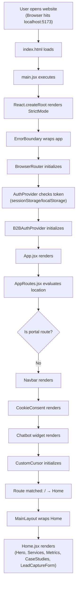

### 3.2 Lead Capture Journey

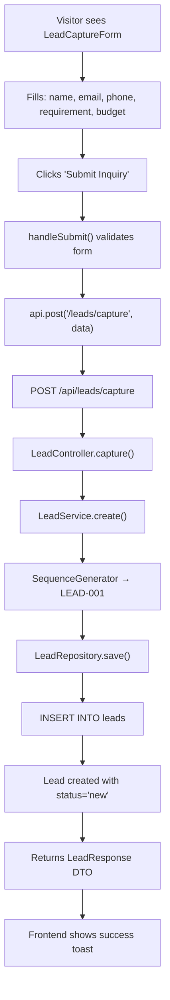

### 3.3 CRM Admin Login Journey

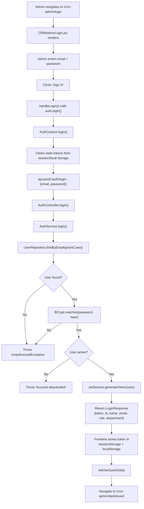

### 3.4 B2B Organization Registration Journey

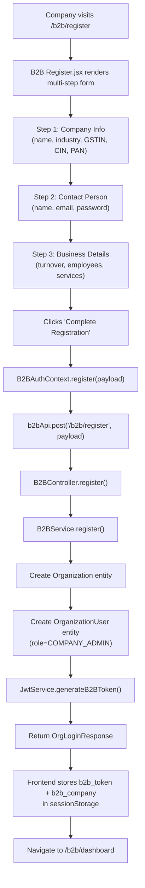

---

## 4. Button Click Analysis

### 4.1 Authentication Buttons

| Button | Component | Function | API | Backend Method | DB Action | Result |
|---|---|---|---|---|---|---|
| **Login** (CRM) | `AdminLogin.jsx` | `handleLogin()` | `POST /api/auth/login` | `AuthService.login()` | `SELECT FROM users WHERE email=?` | JWT Token + redirect to dashboard |
| **Register** (CRM) | `LoginRegistration.jsx` | `handleRegister()` | `POST /api/auth/register` | `AuthService.register()` | `INSERT INTO users` | New user created |
| **B2B Login** | `b2b/Login.jsx` | `handleSubmit()` | `POST /api/b2b/login` | `B2BService.login()` | `SELECT FROM organization_users` | B2B JWT + org data |
| **B2B Register** | `b2b/Register.jsx` | `handleSubmit()` | `POST /api/b2b/register` | `B2BService.register()` | `INSERT INTO organizations + organization_users` | Org + admin user created |
| **Forgot Password** | `ForgotPassword.jsx` | `handleSubmit()` | `POST /api/auth/forgot-password` | `AuthService.forgotPassword()` | `SELECT user; generate purpose token` | Reset email sent |
| **Reset Password** | `ResetPassword.jsx` | `handleSubmit()` | `POST /api/auth/reset-password` | `AuthService.resetPassword()` | `UPDATE users SET password=?` | Password updated |
| **Logout** | `Sidebar.jsx` | `handleLogout()` | None (client-side) | N/A | N/A | Clear tokens, redirect to login |

### 4.2 Lead Management Buttons

| Button | Component | Function | API | Backend Method | DB Action | Result |
|---|---|---|---|---|---|---|
| **Submit Inquiry** | `LeadCaptureForm.jsx` | `handleSubmit()` | `POST /api/leads/capture` | `LeadService.create()` | `INSERT INTO leads` | Lead created |
| **Qualify Lead** | `crm-admin/Leads.jsx` | `handleQualify()` | `PATCH /api/leads/:id` | `LeadService.update()` | `UPDATE leads SET status='qualified'` | Lead qualified |
| **Send to Department** | `crm-admin/Leads.jsx` | `handleSendToDept()` | `POST /api/leads/:id/send-to-department` | `LeadService.sendToDepartment()` | `UPDATE leads SET department=?, status='dept_review'` | Lead routed |
| **Send Fee Proposal** | `department-admin/LeadReview.jsx` | `handleSendProposal()` | `POST /api/leads/:id/send-fee-proposal` | `LeadService.sendFeeProposal()` | `UPDATE leads + INSERT consultation` | Fee proposal created |
| **Convert to Client** | `crm-admin/Leads.jsx` | `handleConvert()` | `POST /api/leads/:id/convert` | `LeadService.convertToClient()` | `INSERT INTO users (role='client') + UPDATE leads SET status='won'` | New client account |
| **Add Note** | `LeadReview.jsx` | `handleAddNote()` | `POST /api/leads/:id/note` | `LeadService.addNote()` | `INSERT INTO lead_notes` | Note added |

### 4.3 Consultation Buttons

| Button | Component | Function | API | Backend Method | DB Action | Result |
|---|---|---|---|---|---|---|
| **Request Consultation** | `ConsultationQueue.jsx` | `handleCreate()` | `POST /api/consultations` | `ConsultationService.create()` | `INSERT INTO consultations` | New consultation |
| **Accept** | `ConsultationQueue.jsx` | `handleAccept()` | `PATCH /api/consultations/:id/accept` | `ConsultationService.accept()` | `UPDATE consultations SET status='accepted'` | Consultation accepted |
| **Assign Consultant** | `ConsultationQueue.jsx` | `handleAssign()` | `PATCH /api/consultations/:id/assign` | `ConsultationService.assign()` | `UPDATE consultations SET consultant_id=?` | Consultant assigned |
| **Schedule Meeting** | `Schedule.jsx` | `handleSchedule()` | `PATCH /api/consultations/:id/schedule` | `ConsultationService.schedule()` | `UPDATE consultations SET confirmed_date=?, meeting_link=?` | Meeting scheduled |
| **Complete** | `Schedule.jsx` | `handleComplete()` | `PATCH /api/consultations/:id/complete` | `ConsultationService.complete()` | `UPDATE consultations SET status='completed'` | Marked complete |

### 4.4 Loan Workflow Buttons

| Button | Component | Function | API | Backend Method | DB Action | Result |
|---|---|---|---|---|---|---|
| **Create Loan Case** | `LoanWorkflow.jsx` | `handleCreate()` | `POST /api/loan-cases` | `LoanCaseService.create()` | `INSERT INTO loan_cases` | New case with caseId |
| **Upload Document** | `LoanWorkflow.jsx` | `handleUpload()` | `PATCH /api/loan-cases/:id` | `LoanCaseService.patch()` | `INSERT INTO loan_case_documents` | Document attached |
| **Verify Document** | `LoanWorkflow.jsx` | `handleVerify()` | `PATCH /api/loan-cases/:id/document/:docId` | `LoanCaseService.updateDocument()` | `UPDATE loan_case_documents SET status='verified'` | Doc verified |
| **Save Eligibility** | `LoanWorkflow.jsx` | `handleEligibility()` | `PATCH /api/loan-cases/:id` | `LoanCaseService.patch()` | `UPDATE loan_cases SET credit_score=?, dti=?, eligible=?` | Eligibility assessed |
| **Send Recommendation** | `LoanWorkflow.jsx` | `handleSendRec()` | `PATCH /api/loan-cases/:id` | `LoanCaseService.patch()` | `UPDATE loan_cases SET sent_to_client=true, stage='recommendation'` | Sent to client |
| **Record Disbursement** | `LoanWorkflow.jsx` | `handleDisburse()` | `POST /api/loan-cases/:id/disburse` | `LoanCaseService.disburse()` | `UPDATE loan_cases + INSERT emi_schedule_items` | Loan disbursed, EMI generated |

### 4.5 Proposal & Invoice Buttons

| Button | Component | Function | API | Backend Method | DB Action | Result |
|---|---|---|---|---|---|---|
| **Create Proposal** | `consultant/Proposals.jsx` | `handleCreate()` | `POST /api/proposals` | `ProposalService.create()` | `INSERT INTO proposals` | Proposal created |
| **Send to Client** | `consultant/Proposals.jsx` | `handleSend()` | `PATCH /api/proposals/:id` | `ProposalService.updateStatus()` | `UPDATE proposals SET status='sent'` | Proposal sent |
| **Approve Proposal** | `b2b/Proposals.jsx` | `handleDecision('approved')` | `PATCH /api/proposals/:id/decision` | `ProposalService.updateStatus()` | `UPDATE proposals SET status='approved'` | Client approved |
| **Create Invoice** | `consultant/Invoices.jsx` | `handleCreate()` | `POST /api/invoices` | `InvoiceService.create()` | `INSERT INTO invoices + invoice_line_items` | Invoice generated |
| **Record Payment** | `consultant/Payments.jsx` | `handlePay()` | `POST /api/payments` | `PaymentService.create()` | `INSERT INTO payments + UPDATE invoices SET status='paid'` | Payment recorded |

### 4.6 B2B Portal Buttons

| Button | Component | Function | API | Backend Method | DB Action | Result |
|---|---|---|---|---|---|---|
| **Submit Service Request** | `b2b/ServiceRequests.jsx` | `handleSubmit()` | `POST /api/b2b/organizations/:orgId/service-requests` | `B2BService.createServiceRequest()` | `INSERT INTO service_requests` | Service request created |
| **Upload KYC Document** | `b2b/Documents.jsx` | `handleUpload()` | `POST /api/b2b/organizations/:orgId/documents` | `B2BService.uploadDocument()` | `INSERT INTO organization_documents` | Document uploaded (base64) |
| **Pay Invoice** | `b2b/Payments.jsx` | `handlePay()` | `POST /api/b2b/payments/:paymentId/pay` | `B2BService.payPayment()` | `UPDATE organization_payments SET status='paid'` | Payment settled |
| **Add Team Member** | `b2b/Team.jsx` | `handleAdd()` | `POST /api/b2b/organizations/:orgId/team` | `B2BService.addTeamMember()` | `INSERT INTO organization_users` | New team member |
| **Create Support Ticket** | `b2b/Support.jsx` | `handleSubmit()` | `POST /api/b2b/organizations/:orgId/support` | `B2BService.createTicket()` | `INSERT INTO support_tickets` | Ticket created |
| **Accept/Reject Proposal** | `b2b/Proposals.jsx` | `handleDecision()` | `PATCH /api/b2b/proposals/:id/decision` | `B2BService.decideProposal()` | `UPDATE organization_proposals SET decision=?` | Decision recorded |

---

## 5. Complete Frontend Flow

### 5.1 Component Hierarchy

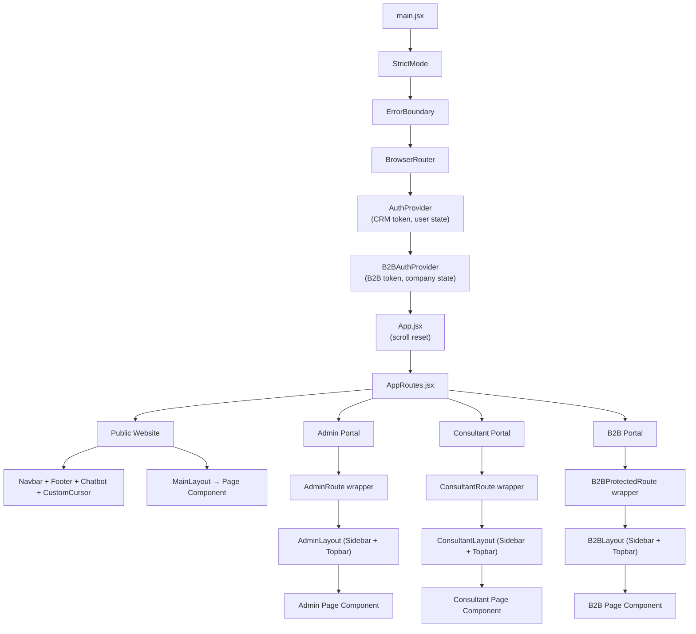

### 5.2 State Management

| State Type | Implementation | Scope | Files |
|---|---|---|---|
| **CRM Auth State** | React Context API | Global (all CRM users) | `AuthContext.jsx` |
| **B2B Auth State** | React Context API | Global (B2B users) | `B2BAuthContext.jsx` |
| **Page-level State** | `useState` hooks | Local per-component | Every page component |
| **Form State** | `useState` hooks | Local per-form | All forms |
| **Token Storage** | `sessionStorage` + `localStorage` | Browser session + persistent | `AuthContext.jsx`, `B2BAuthContext.jsx` |

### 5.3 API Service Layer

**`api.js`** (CRM Axios Instance):
- Base URL: dynamically resolved from `VITE_API_URL` or `window.location`
- **Request interceptor**: Attaches JWT from `sessionStorage`/`localStorage` (skips public endpoints)
- **Response interceptor**: 
  - Normalizes Spring `Page` objects → bare arrays
  - Adds `_id` alias for `id` (backward compat with old Mongo frontend)

**`b2bApi.js`** (B2B Axios Instance):
- Separate token from `sessionStorage` (`b2b_token`)
- **Auto-logout**: On 401/403, clears session and redirects to `/b2b/login`

### 5.4 Routing Architecture (80+ routes)

| Route Group | Base Path | Guard | Layout | Page Count |
|---|---|---|---|---|
| Public Website | `/`, `/about`, `/services`, etc. | None | `MainLayout` (Navbar+Footer) | 20+ |
| Auth Pages | `/admin/login`, `/b2b/login`, etc. | None | None | 7 |
| Super Admin | `/admin/*` | `AdminRoute` (ProtectedRoute + RoleBasedRoute[admin]) | `AdminLayout` | 14 |
| CRM Admin | `/crm-admin/*` | `CRMAdminRoute` | `CRMAdminLayout` | 4 |
| Department Admin | `/department-admin/*` | `DepartmentAdminRoute` + department check | `DepartmentAdminLayout` | 12 |
| Consultant | `/consultant/*`, `/department-consultant/*` | `ConsultantRoute` / `DepartmentConsultantRoute` | `ConsultantLayout` | 16 |
| B2B Portal | `/b2b/*` | `B2BProtectedRoute` | `B2BLayout` | 9 |
| Workflow | `/workflow/*` | `ProtectedRoute` (most steps) | None | 7 |
| Legacy Redirects | `/client/*`, `/dashboard`, `/login` | N/A | N/A | 12 redirects |

---

## 6. Complete Backend Flow

### 6.1 Request Processing Pipeline

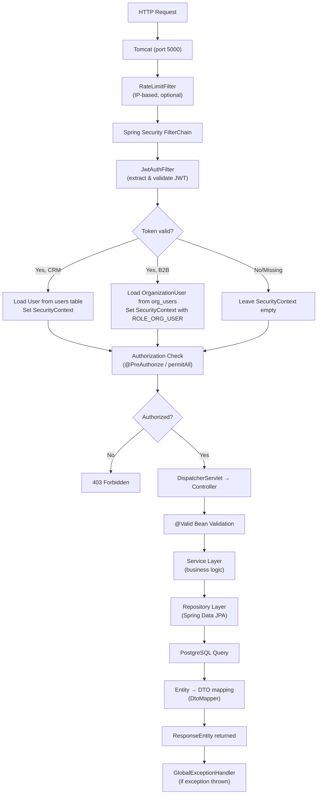

### 6.2 Controller → Service → Repository Mapping

| Controller | Service | Primary Repository | Primary Entity |
|---|---|---|---|
| `AuthController` | `AuthService`, `UserService` | `UserRepository` | `User` |
| `B2BController` | `B2BService` | `OrganizationRepository`, `OrganizationUserRepository`, etc. | `Organization`, `OrganizationUser`, etc. |
| `LeadController` | `LeadService` | `LeadRepository` | `Lead` |
| `ConsultationController` | `ConsultationService` | `ConsultationRepository` | `Consultation` |
| `LoanCaseController` | `LoanCaseService` | `LoanCaseRepository` | `LoanCase` |
| `DeptCaseController` | `DeptCaseService` | `DeptCaseRepository` | `DeptCase` |
| `ProposalController` | `ProposalService` | `ProposalRepository` | `Proposal` |
| `InvoiceController` | `InvoiceService` | `InvoiceRepository` | `Invoice` |
| `PaymentController` | `PaymentService` | `PaymentRepository` | `Payment` |
| `KycController` | `KycService` | `OrganizationDocumentRepository` | `OrganizationDocument` |
| `NotificationController` | `NotificationService` | `NotificationRepository` | `Notification` |
| `FinancialProfileController` | (direct repo) | `FinancialProfileRepository` | `FinancialProfile` |
| `ChatController` | `UserService` | `ChatMessageRepository` | `ChatMessage` |
| `DashboardController` | (direct repos) | `UserRepo`, `LeadRepo`, `LoanRepo`, `InvoiceRepo` | Aggregates |

---

## 7. Database Analysis

### 7.1 Entity-Relationship Diagram

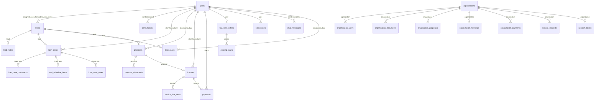

### 7.2 Complete Table Schema

#### `users` (Core User Table)

| Column | Type | Constraints | Purpose |
|---|---|---|---|
| `id` | `UUID` | PK, auto-generated | Unique identifier |
| `name` | `VARCHAR` | NOT NULL | Display name |
| `email` | `VARCHAR` | NOT NULL, UNIQUE | Login email |
| `password` | `VARCHAR` | NOT NULL | BCrypt hash |
| `role` | `VARCHAR` | NOT NULL, default='client' | One of: admin, crm-admin, department-admin, consultant, client |
| `department` | `VARCHAR` | nullable | loans, insurance, investments, tax, wealth |
| `phone` | `VARCHAR` | nullable | Contact phone |
| `company_name` | `VARCHAR` | nullable | Company name for clients |
| `is_active` | `BOOLEAN` | NOT NULL, default=true | Soft delete flag |
| `is_email_verified` | `BOOLEAN` | default=false | Email verification status |
| `created_at` | `TIMESTAMP` | auto | Creation timestamp |
| `updated_at` | `TIMESTAMP` | auto | Last update timestamp |

#### `leads` (CRM Pipeline)

| Column | Type | Constraints | Purpose |
|---|---|---|---|
| `id` | `UUID` | PK | Unique identifier |
| `lead_id` | `VARCHAR` | UNIQUE | Human-readable ID (LEAD-001) |
| `name`, `email`, `phone` | `VARCHAR` | name/email NOT NULL | Contact info |
| `income` | `DECIMAL` | nullable | Annual income |
| `requirement` | `VARCHAR` | nullable | Service requirement description |
| `budget` | `DECIMAL` | nullable | Budget amount |
| `source` | `VARCHAR` | default='website_form' | Lead source |
| `status` | `VARCHAR` | default='new' | new → contacted → qualified → dept_review → proposal_sent → won → lost |
| `priority` | `VARCHAR` | default='warm' | cold, warm, hot |
| `score` | `INT` | default=0 | Lead score (0-100) |
| `department` | `VARCHAR` | nullable | Assigned department |
| `service_type` | `VARCHAR` | nullable | Specific service type |
| `assigned_consultant` | `UUID FK→users` | nullable | Assigned consultant |
| `assigned_admin` | `UUID FK→users` | nullable | Department admin |
| `crm_owner` | `UUID FK→users` | nullable | CRM admin owner |
| `converted_client_id` | `UUID FK→users` | nullable | Converted client user |
| `follow_up_date` | `TIMESTAMP` | nullable | Next follow-up |
| `tags` | `TEXT[]` | nullable | PostgreSQL array |

#### `organizations` (B2B Companies)

| Column | Type | Constraints | Purpose |
|---|---|---|---|
| `id` | `UUID` | PK | Unique identifier |
| `company_name` | `VARCHAR` | NOT NULL | Company name |
| `industry` | `VARCHAR` | nullable | Industry sector |
| `gstin`, `cin`, `pan` | `VARCHAR` | nullable | Indian regulatory IDs |
| `annual_turnover` | `DECIMAL` | nullable | Annual revenue |
| `employee_count` | `INT` | nullable | Employee headcount |
| `address`, `city`, `state`, `pincode` | `VARCHAR` | nullable | Location |
| `website` | `VARCHAR` | nullable | Company website |
| `services` | `TEXT[]` | nullable | Subscribed services |
| `status` | `VARCHAR` | default='pending' | pending, active, suspended |
| `kyc_verified` | `BOOLEAN` | default=false | KYC complete flag |

#### `loan_cases` (Loan Workflow State Machine)

| Column | Type | Purpose |
|---|---|---|
| `id` | `UUID PK` | Unique identifier |
| `case_id` | `VARCHAR UNIQUE` | CASE-001 format |
| `client_id` | `UUID FK→users` | Borrower |
| `consultant_id` | `UUID FK→users` | Handling consultant |
| `lead_id` | `UUID FK→leads` | Originating lead |
| `stage` | `VARCHAR` | document_collection → eligibility → recommendation → client_review → bank_processing → disbursement → emi_tracking → closed |
| `loan_type`, `requested_amount`, `approved_amount` | various | Loan details |
| `interest_rate`, `tenure_months`, `monthly_emi` | various | Terms |
| `bank_name`, `disbursed_date`, `disbursed_amount` | various | Bank details |
| `credit_score`, `dti`, `ltv`, `eligible` | various | Eligibility assessment |
| `recommended_bank/rate/tenure/emi` | various | Consultant recommendation |
| `sent_to_client`, `client_decision`, `client_feedback` | various | Client approval flow |
| `application_ref`, `bank_status`, `bank_remarks` | various | Bank processing |
| `proposal_id`, `invoice_id` | `UUID` | Linked proposal/invoice |

#### `dept_cases` (Generic Department Cases — Tax/Investment/Insurance/Wealth)

| Column | Type | Purpose |
|---|---|---|
| `id` | `UUID PK` | Unique identifier |
| `case_id` | `VARCHAR UNIQUE` | Auto-generated ID |
| `department` | `VARCHAR NOT NULL` | tax, investments, insurance, wealth |
| `client_id`, `consultant_id`, `lead_id` | `UUID FK` | Related entities |
| `stage` | `VARCHAR` | Workflow stage |
| `data` | `JSONB NOT NULL` | Polymorphic workflow data (department-specific) |
| `invoice_id` | `UUID` | Linked invoice |

#### Other Key Tables

| Table | Purpose | Key Relationships |
|---|---|---|
| `consultations` | Consultation/meeting scheduling | client → users, consultant → users |
| `proposals` | Service proposals with JSONB details | lead, client, consultant → users |
| `invoices` | Billing with line items | client, consultant → users, proposal → proposals |
| `payments` | Payment records (Razorpay) | client → users, invoice → invoices |
| `financial_profiles` | Client financial data | 1:1 with users |
| `notifications` | In-app notifications with JSONB metadata | user → users |
| `chat_messages` | Internal messaging | sender, recipient → users |
| `organization_users` | B2B portal logins | organization → organizations |
| `organization_documents` | KYC documents (base64 stored) | organization → organizations |
| `organization_proposals` | B2B proposals | organization → organizations |
| `organization_meetings` | B2B meetings | organization → organizations |
| `organization_payments` | B2B payment records | organization → organizations |
| `service_requests` | B2B service requests | organization → organizations |
| `support_tickets` | B2B support tickets | organization → organizations |
| `lead_notes` | CRM lead notes | lead → leads |
| `loan_case_documents` | Loan document checklist | loanCase → loan_cases |
| `emi_schedule_items` | EMI payment schedule | loanCase → loan_cases |
| `loan_case_notes` | Loan case notes | loanCase → loan_cases |
| `existing_loans` | Client's existing loans | profile → financial_profiles |
| `loan_products` | Loan product catalog | Standalone |

---

## 8. Authentication Flow

### 8.1 Dual Authentication System

FinBridge runs **two parallel authentication systems**:

#### CRM Authentication (Internal Staff)
- **Token key**: `finbridge_token`
- **Storage**: `sessionStorage` (tab-isolated) + `localStorage` (cross-tab persistence)
- **Context**: `AuthContext.jsx`
- **API instance**: `api.js`
- **Roles**: admin, crm-admin, department-admin, consultant, client
- **JWT claims**: `{ sub: userId, email, role, name }`

#### B2B Authentication (Organization Portal)
- **Token key**: `b2b_token`
- **Storage**: `sessionStorage` only (tab-isolated)
- **Context**: `B2BAuthContext.jsx`
- **API instance**: `b2bApi.js`
- **Roles**: COMPANY_ADMIN, FINANCE_MANAGER, DIRECTOR, EMPLOYEE
- **JWT claims**: `{ sub: orgUserId, organizationId, type: "b2b" }`

### 8.2 Registration Flow

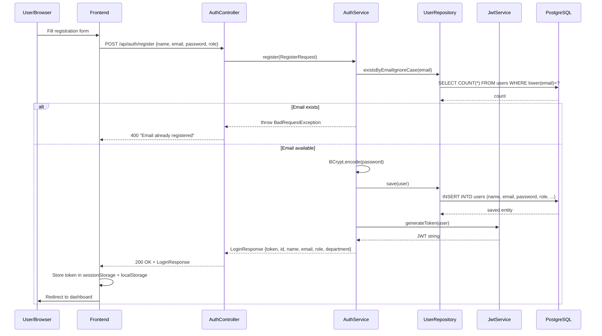

### 8.3 Login Flow

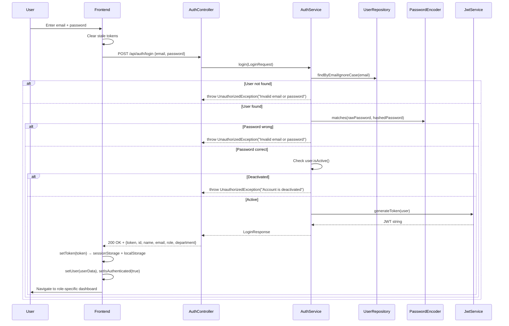

### 8.4 JWT Token Validation (Every Authenticated Request)

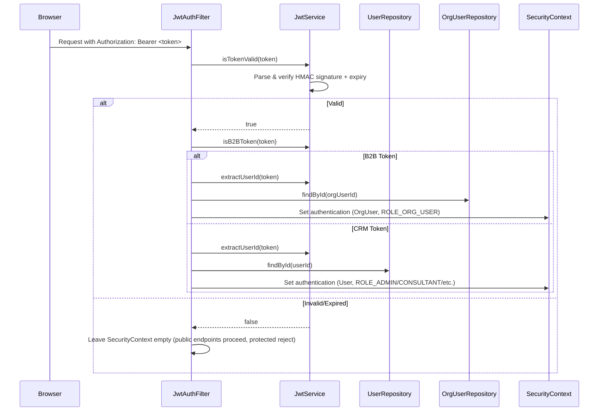

### 8.5 Password Reset Flow

1. User clicks "Forgot Password" → `POST /api/auth/forgot-password { email }`
2. `AuthService.forgotPassword()` looks up user, generates a **purpose-scoped JWT** (`purpose: "reset-password"`, TTL: 1 hour)
3. Sends email with link: `{frontendUrl}/reset-password?token=<jwt>`
4. User clicks link → `ResetPassword.jsx` renders
5. User enters new password → `POST /api/auth/reset-password { token, newPassword }`
6. `AuthService.resetPassword()` verifies purpose token, updates BCrypt hash

### 8.6 Email Verification Flow

1. On registration (future: auto-send), a purpose token is generated (`purpose: "verify-email"`, TTL: 24h)
2. Email contains: `{frontendUrl}/verify-email?token=<jwt>`
3. User clicks → `POST /api/auth/verify-email { token }`
4. `AuthService.verifyEmail()` verifies token, sets `user.emailVerified = true`

---

## 9. Role-Based Access Flow

### 9.1 Access Matrix

| Feature | Super Admin | CRM Admin | Dept Admin | Consultant | B2B Client |
|---|---|---|---|---|---|
| User Management | ✅ Full CRUD | ❌ | ❌ | ❌ | ❌ |
| Consultant Management | ✅ | ❌ | ✅ (own dept) | ❌ | ❌ |
| Lead Capture (public) | ✅ | ✅ | ✅ | ✅ | ❌ |
| Lead Management | ✅ All | ✅ All | ✅ Dept only | ✅ Dept only | ❌ |
| Lead Conversion | ✅ | ✅ | ✅ | ❌ | ❌ |
| Department Assignment | ✅ | ✅ | ✅ | ❌ | ❌ |
| Consultations | ✅ All | ✅ All | ✅ Dept | ✅ Own | ❌ |
| Loan Workflow | ✅ All | ❌ | ✅ Dept | ✅ Own cases | ❌ |
| Proposals | ✅ All | ❌ | ✅ Dept | ✅ Own | ✅ View/Decide |
| Invoices | ✅ All | ❌ | ✅ Dept | ✅ Own | ❌ |
| Payments | ✅ All | ❌ | ✅ Dept | ✅ Own | ✅ Own org |
| KYC Review | ✅ | ❌ | ✅ | ✅ | ❌ |
| Analytics | ✅ | ❌ | ❌ | ❌ | ❌ |
| System Settings | ✅ | ❌ | ❌ | ❌ | ❌ |
| B2B Portal | ❌ | ❌ | ❌ | ❌ | ✅ Full |
| Service Requests | ❌ | ❌ | ✅ View | ❌ | ✅ Create |
| Support Tickets | ❌ | ❌ | ❌ | ❌ | ✅ |

### 9.2 Backend Authorization

**Spring Security `@PreAuthorize` expressions** (defined in `SecurityRoles.java`):

| Constant | Expression | Who Matches |
|---|---|---|
| `STAFF` | `hasAnyRole('SUPER_ADMIN','ADMIN','CRM_ADMIN','DEPARTMENT_ADMIN','CONSULTANT')` | All internal staff |
| `ADMINS` | `hasAnyRole('SUPER_ADMIN','ADMIN')` | Platform admins only |
| `ADMIN_OR_DEPT` | `hasAnyRole('SUPER_ADMIN','ADMIN','DEPARTMENT_ADMIN')` | Admins + dept admins |

**B2B Access**: `B2BAccessGuard.assertOrgAccess(principal, orgId)` — ensures the authenticated `OrganizationUser` belongs to the requested organization.

### 9.3 Frontend Route Guards

| Guard Component | Logic |
|---|---|
| `ProtectedRoute` | Checks `isAuthenticated` from `AuthContext`; redirects to role-specific login |
| `RoleBasedRoute` | Checks `user.role` against `allowedRoles[]` + optional `allowedDepartment` |
| `B2BProtectedRoute` | Checks `company` from `B2BAuthContext`; redirects to `/b2b/login` |
| `AdminRoute` | `ProtectedRoute` + `RoleBasedRoute(['admin'])` |
| `CRMAdminRoute` | `ProtectedRoute` + `RoleBasedRoute(['crm-admin'])` |
| `DepartmentAdminRoute` | `ProtectedRoute` + `RoleBasedRoute(['department-admin'])` + department check |
| `ConsultantRoute` | `ProtectedRoute` + `RoleBasedRoute(['consultant'])` |

---

## 10. API Flow Mapping

### 10.1 Complete API Endpoint Reference

#### Authentication (`/api/auth`)

| Method | Path | Auth | Description |
|---|---|---|---|
| `POST` | `/api/auth/register` | Public | Register new user |
| `POST` | `/api/auth/login` | Public | Login, receive JWT |
| `GET` | `/api/auth/me` | JWT | Get current user |
| `POST` | `/api/auth/verify-email` | Public | Verify email token |
| `POST` | `/api/auth/forgot-password` | Public | Request password reset |
| `POST` | `/api/auth/reset-password` | Public | Reset password with token |
| `GET` | `/api/auth/consultants` | STAFF | List consultants |
| `POST` | `/api/auth/create-consultant` | ADMIN_OR_DEPT | Create consultant |
| `PATCH` | `/api/auth/consultants/:id` | ADMIN_OR_DEPT | Update consultant |
| `DELETE` | `/api/auth/consultants/:id` | ADMIN_OR_DEPT | Deactivate consultant |
| `GET` | `/api/auth/admins` | ADMINS | List admins |
| `POST` | `/api/auth/create-admin` | ADMINS | Create admin |
| `PATCH` | `/api/auth/admins/:id` | ADMINS | Update admin |
| `DELETE` | `/api/auth/admins/:id` | ADMINS | Deactivate admin |
| `GET` | `/api/auth/clients` | STAFF | List all clients |
| `GET` | `/api/auth/consultant/clients` | STAFF | Consultant's clients |
| `GET` | `/api/auth/users` | ADMINS | Get all users |
| `PATCH` | `/api/auth/users/:id/status` | ADMINS | Toggle user active status |

#### Leads (`/api/leads`)

| Method | Path | Auth | Description |
|---|---|---|---|
| `POST` | `/api/leads/capture` | Public | Website lead capture |
| `GET` | `/api/leads` | STAFF | List leads (with filters) |
| `GET` | `/api/leads/stats` | STAFF | Pipeline statistics |
| `GET` | `/api/leads/:id` | STAFF | Get single lead |
| `POST` | `/api/leads` | STAFF | Create lead manually |
| `PATCH` | `/api/leads/:id` | STAFF | Update lead |
| `POST` | `/api/leads/:id/note` | STAFF | Add note |
| `POST` | `/api/leads/:id/send-to-department` | STAFF | Route to department |
| `POST` | `/api/leads/:id/send-fee-proposal` | STAFF | Send fee proposal |
| `POST` | `/api/leads/:id/convert` | STAFF | Convert to client |

#### Consultations (`/api/consultations`)

| Method | Path | Auth | Description |
|---|---|---|---|
| `GET` | `/api/consultations` | JWT | List for user |
| `GET` | `/api/consultations/:id` | JWT | Get one |
| `POST` | `/api/consultations` | JWT | Create |
| `PATCH` | `/api/consultations/:id` | JWT | Update fields |
| `PATCH` | `/api/consultations/:id/accept` | JWT | Accept consultation |
| `PATCH` | `/api/consultations/:id/assign` | JWT | Assign consultant |
| `PATCH` | `/api/consultations/:id/schedule` | JWT | Schedule meeting |
| `PATCH` | `/api/consultations/:id/send-to-client` | JWT | Notify client |
| `PATCH` | `/api/consultations/:id/complete` | JWT | Mark complete |
| `POST` | `/api/consultations/:id/verify-complete` | JWT | Admin verify |
| `GET` | `/api/consultations/completed-list` | JWT | Completed meetings |
| `GET` | `/api/consultations/payments` | JWT | Consultant payments |
| `GET` | `/api/consultations/payments/admin` | JWT | Admin payment view |

#### Loan Cases (`/api/loan-cases`)

| Method | Path | Auth | Description |
|---|---|---|---|
| `GET` | `/api/loan-cases` | STAFF | List cases |
| `POST` | `/api/loan-cases` | STAFF | Create case |
| `PATCH` | `/api/loan-cases/:id` | STAFF | Update case fields/stage |
| `PATCH` | `/api/loan-cases/:id/document/:docId` | STAFF | Verify/reject document |
| `POST` | `/api/loan-cases/:id/disburse` | STAFF | Record disbursement + generate EMI |
| `PATCH` | `/api/loan-cases/:id/emi/:emiId` | STAFF | Update EMI payment status |
| `POST` | `/api/loan-cases/:id/note` | STAFF | Add note |

#### B2B Portal (`/api/b2b`)

| Method | Path | Auth | Description |
|---|---|---|---|
| `POST` | `/api/b2b/register` | Public | Register organization |
| `POST` | `/api/b2b/login` | Public | Organization login |
| `GET` | `/api/b2b/organizations/:orgId/stats` | B2B | Dashboard stats |
| `GET` | `/api/b2b/organizations/:orgId` | B2B | Get org details |
| `POST` | `/api/b2b/organizations/:orgId/service-requests` | B2B | Create service request |
| `GET` | `/api/b2b/organizations/:orgId/service-requests` | B2B | List service requests |
| `PATCH` | `/api/b2b/service-requests/:id/status` | B2B/STAFF | Update status |
| `GET` | `/api/b2b/organizations/:orgId/proposals` | B2B | List proposals |
| `PATCH` | `/api/b2b/proposals/:id/decision` | B2B | Accept/reject proposal |
| `GET` | `/api/b2b/organizations/:orgId/meetings` | B2B | List meetings |
| `GET` | `/api/b2b/organizations/:orgId/payments` | B2B | List payments |
| `POST` | `/api/b2b/payments/:paymentId/pay` | B2B | Pay invoice |
| `GET` | `/api/b2b/payments/:paymentId/invoice` | B2B | Download invoice |
| `GET` | `/api/b2b/organizations/:orgId/team` | B2B | List team |
| `POST` | `/api/b2b/organizations/:orgId/team` | B2B | Add team member |
| `GET` | `/api/b2b/organizations/:orgId/support` | B2B | List tickets |
| `POST` | `/api/b2b/organizations/:orgId/support` | B2B | Create ticket |
| `GET` | `/api/b2b/organizations/:orgId/documents` | B2B | List documents |
| `POST` | `/api/b2b/organizations/:orgId/documents` | B2B | Upload KYC doc |
| `GET` | `/api/b2b/organizations/:orgId/documents/:docId/file` | B2B | Download document |

---

## 11. Form Submission Flow

### 11.1 Lead Capture Form (`LeadCaptureForm.jsx`)

| Step | Detail |
|---|---|
| **Input Fields** | name, email, phone, requirement (dropdown), budget, income |
| **Validation** | Required: name, email, phone. Email format. Phone format. |
| **Submit Function** | `handleSubmit()` |
| **API Call** | `api.post('/leads/capture', formData)` |
| **Backend Validation** | `@Valid @RequestBody LeadRequest` — Bean Validation annotations |
| **Database Save** | `LeadRepository.save()` → INSERT INTO leads |
| **Success Response** | `LeadResponse { id, leadId, name, email, status, ... }` |
| **UI Feedback** | `toast.success("Thank you! We'll contact you soon.")` |

### 11.2 B2B Registration Form (`b2b/Register.jsx`)

| Step | Detail |
|---|---|
| **Input Fields** | companyName, industry, gstin, cin, pan, annualTurnover, employeeCount, address, city, state, pincode, website, services[], contactName, contactEmail, password |
| **Validation** | Required: companyName, industry, contactName, contactEmail, password. Password min 6 chars. |
| **Submit Function** | `handleSubmit()` |
| **API Call** | `b2bApi.post('/b2b/register', payload)` |
| **Backend Validation** | `@Valid @RequestBody OrgRegisterRequest` |
| **Database Save** | `OrganizationRepository.save()` + `OrganizationUserRepository.save()` |
| **Success Response** | `OrgLoginResponse { token, organizationId, companyName, userId, role, ... }` |

---

## 12. State Management Analysis

### 12.1 Global State (Context API)

#### AuthContext State

```
{
  user: { id, name, email, role, department } | null,
  isAuthenticated: boolean,
  loading: boolean,
  hasFinancialProfile: boolean,
  login: async (email, password) => User,
  register: async (name, email, password, role, phone, companyName, department) => result,
  logout: () => void,
  checkProfile: async (user) => boolean
}
```

#### B2BAuthContext State

```
{
  company: { token, organizationId, companyName, userId, role, ... } | null,
  login: async (email, password) => data,
  register: async (payload) => data,
  logout: () => void,
  refreshProfile: async () => updatedCompany
}
```

### 12.2 Token Storage Strategy

```
┌─────────────────────────────────────────────────────┐
│                    CRM Token                         │
│  sessionStorage: finbridge_token (tab-isolated)      │
│  localStorage: finbridge_token (cross-tab fallback)  │
│                                                       │
│  On login: written to BOTH                            │
│  On logout: cleared from BOTH                         │
│  New tab: copies from localStorage → sessionStorage   │
│  Each tab can switch to a different portal             │
├─────────────────────────────────────────────────────┤
│                    B2B Token                          │
│  sessionStorage: b2b_token (tab-isolated only)       │
│  sessionStorage: b2b_company (JSON company data)      │
│                                                       │
│  Fully isolated: no cross-tab sharing                 │
│  Auto-logout on 401/403 (interceptor in b2bApi.js)   │
└─────────────────────────────────────────────────────┘
```

---

## 13. Error Handling Flow

### 13.1 Backend Error Handling (`GlobalExceptionHandler.java`)

| Exception | HTTP Status | Response Body |
|---|---|---|
| `ResourceNotFoundException` | 404 | `{ status: "error", message: "..." }` |
| `BadRequestException` | 400 | `{ status: "error", message: "..." }` |
| `UnauthorizedException` | 401 | `{ status: "error", message: "..." }` |
| `AccessDeniedException` | 403 | `{ status: "error", message: "Forbidden: insufficient permissions" }` |
| `MethodArgumentNotValidException` | 400 | `{ status: "error", message: "Validation failed", errors: { field: "message" } }` |
| `HttpMessageNotReadableException` | 400 | `{ status: "error", message: "Malformed or invalid request body" }` |
| `Exception` (catch-all) | 500 | `{ status: "error", message: "An unexpected error...", ref: "<UUID>" }` |

### 13.2 Frontend Error Handling

| Layer | Mechanism | File |
|---|---|---|
| **React Boundary** | `ErrorBoundary.jsx` — catches render errors, shows fallback UI | `components/ErrorBoundary.jsx` |
| **API Errors** | Axios interceptors; `authErrMsg()` extracts validation messages | `AuthContext.jsx` |
| **B2B Auto-logout** | 401/403 interceptor clears session, redirects to login | `b2bApi.js` |
| **Toast Notifications** | `react-hot-toast` for all success/error feedback | All page components |
| **Form Validation** | Client-side validation before API call | Each form component |

---

## 14. Complete FinBridge Business Workflow

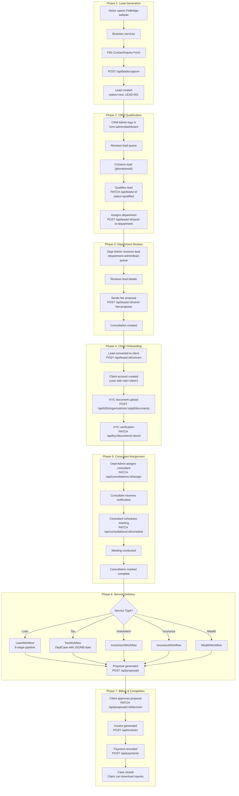

### Loan Case Workflow Detail (8 Stages)

| Stage | Consultant Actions | DB Changes |
|---|---|---|
| 1. `document_collection` | Upload/verify client documents (ID, income proof, bank statements) | `loan_case_documents` INSERT/UPDATE |
| 2. `eligibility` | Run credit check, calculate DTI/LTV ratios | `loan_cases` SET credit_score, dti, ltv, eligible |
| 3. `recommendation` | Select bank, propose terms | `loan_cases` SET recommended_bank/rate/tenure/emi |
| 4. `client_review` | Send recommendation to client | `loan_cases` SET sent_to_client=true |
| 5. `bank_processing` | Submit to bank, track application | `loan_cases` SET application_ref, bank_status |
| 6. `disbursement` | Record loan disbursement | `loan_cases` SET disbursed_amount/date; INSERT emi_schedule_items |
| 7. `emi_tracking` | Track monthly EMI payments | UPDATE `emi_schedule_items` SET status=paid |
| 8. `closed` | Case complete | `loan_cases` SET stage='closed' |

---

## 15. Sequence Diagrams

### 15.1 Login Sequence

```mermaid
sequenceDiagram
    actor U as User
    participant FE as React Frontend
    participant AX as Axios (api.js)
    participant SC as SecurityFilterChain
    participant AC as AuthController
    participant AS as AuthService
    participant UR as UserRepository
    participant JWT as JwtService
    participant DB as PostgreSQL

    U->>FE: Enter credentials, click Login
    FE->>FE: Clear stale tokens
    FE->>AX: POST /api/auth/login (no auth header)
    AX->>SC: HTTP Request (no Bearer token)
    SC->>AC: Route to controller (permitAll)
    AC->>AS: login(LoginRequest)
    AS->>UR: findByEmailIgnoreCase(email)
    UR->>DB: SELECT * FROM users WHERE lower(email) = ?
    DB-->>UR: User entity
    AS->>AS: BCrypt.matches(password, hash)
    AS->>JWT: generateToken(user)
    JWT-->>AS: JWT string (24h expiry)
    AS-->>AC: LoginResponse
    AC-->>FE: 200 {token, id, name, email, role, department}
    FE->>FE: sessionStorage.setItem('finbridge_token', token)
    FE->>FE: localStorage.setItem('finbridge_token', token)
    FE->>FE: setUser(user), setIsAuthenticated(true)
    FE->>U: Navigate to role dashboard
```

### 15.2 Lead Management Sequence

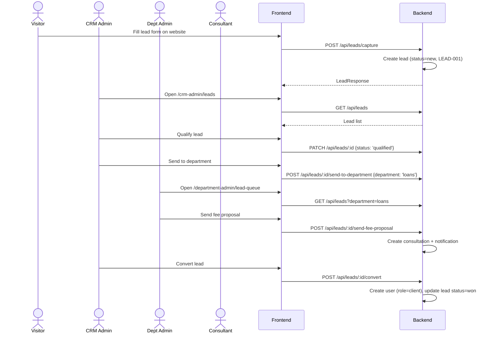

### 15.3 Client Workflow Sequence (Loan)

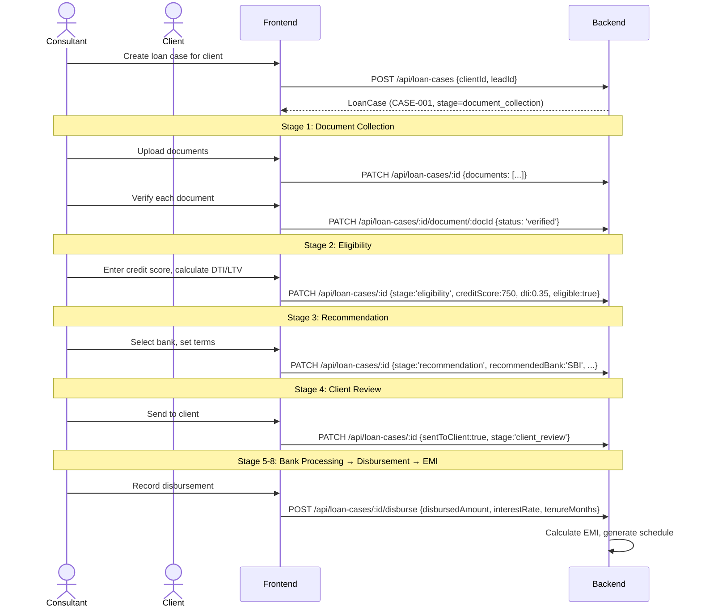

---

## 16. Function Analysis (Key Functions)

### 16.1 Frontend Key Functions

| Function | File | Purpose | Called By | Calls | Failure Impact |
|---|---|---|---|---|---|
| `login()` | `AuthContext.jsx` | Authenticates CRM user | Login pages | `api.post('/auth/login')` | User cannot access CRM |
| `register()` | `AuthContext.jsx` | Registers new user | Registration form | `api.post('/auth/register')` | User cannot create account |
| `logout()` | `AuthContext.jsx` | Clears session | Sidebar logout button | `clearToken()` | Token persists, stale session |
| `normalizeData()` | `api.js` | Converts Spring Page→array, adds `_id` alias | Axios response interceptor | recursive | Frontend shows empty data |
| `getBaseURL()` | `api.js` | Dynamic API URL resolution | Axios instance creation | `window.location` | API calls fail |
| `getDepartmentDashboardPath()` | `departmentAccess.js` | Resolves dashboard route per role | `DepartmentDashboardRedirect` | None | Wrong dashboard shown |
| `handleSubmit()` | `LeadCaptureForm.jsx` | Validates and submits lead | Form submit button | `api.post('/leads/capture')` | Lead not captured |

### 16.2 Backend Key Functions

| Function | File | Purpose | Called By | Calls | Failure Impact |
|---|---|---|---|---|---|
| `generateToken(User)` | `JwtService.java` | Creates JWT with user claims | `AuthService.login/register` | JJWT builder | No authentication possible |
| `doFilterInternal()` | `JwtAuthFilter.java` | Validates JWT on every request | Spring Security filter chain | `jwtService.isTokenValid()` | All protected routes fail |
| `register(RegisterRequest)` | `AuthService.java` | Creates new user with hashed password | `AuthController.register()` | `userRepository.save()` | Registration broken |
| `create(Lead)` | `LeadService.java` | Creates lead with auto-ID | `LeadController.capture()` | `SequenceGenerator`, `leadRepository.save()` | Leads not captured |
| `convertToClient(UUID)` | `LeadService.java` | Creates user from lead, updates status | `LeadController.convert()` | `userRepository.save()`, `leadRepository.save()` | Conversion fails |
| `create(body, user)` | `LoanCaseService.java` | Creates loan case with auto-ID | `LoanCaseController.create()` | `SequenceGenerator`, `loanCaseRepository.save()` | Loan workflows broken |
| `disburse(id, body, user)` | `LoanCaseService.java` | Records disbursement, generates EMI schedule | `LoanCaseController.disburse()` | EMI calculation, bulk save | Disbursement tracking fails |

---

## 17. Dependency Analysis

### 17.1 Frontend Dependencies (`package.json`)

| Package | Version | Purpose | Used In |
|---|---|---|---|
| `react` | ^19.2.6 | UI library | Everywhere |
| `react-dom` | ^19.2.6 | DOM rendering | `main.jsx` |
| `react-router-dom` | ^7.5.2 | Client-side routing | `AppRoutes.jsx`, all navigation |
| `axios` | ^1.17.0 | HTTP client | `api.js`, `b2bApi.js` |
| `framer-motion` | ^12.5.0 | Animations | Route transitions, page animations |
| `lucide-react` | ^1.17.0 | Icon library | All components |
| `react-hot-toast` | ^2.6.0 | Toast notifications | All pages |
| `recharts` | ^3.8.1 | Charts/graphs | Dashboard, Analytics pages |
| `tailwindcss` | ^4.3.0 | CSS framework | All styling |
| `vite` | ^8.0.12 | Build tool | Dev server, production build |

### 17.2 Backend Dependencies (`pom.xml`)

| Dependency | Version | Purpose | Used In |
|---|---|---|---|
| `spring-boot-starter-web` | 3.2.5 | REST API, Tomcat | All controllers |
| `spring-boot-starter-data-jpa` | 3.2.5 | JPA/Hibernate ORM | All repositories |
| `spring-boot-starter-security` | 3.2.5 | Authentication/Authorization | SecurityConfig, filters |
| `spring-boot-starter-validation` | 3.2.5 | Bean Validation | DTO validation |
| `spring-boot-starter-mail` | 3.2.5 | Email sending | EmailService |
| `spring-boot-starter-actuator` | 3.2.5 | Health checks | `/actuator/health` |
| `postgresql` | runtime | PostgreSQL JDBC driver | Database connectivity |
| `jjwt-api/impl/jackson` | 0.12.5 | JWT creation/parsing | JwtService |
| `lombok` | 1.18.40 | Boilerplate reduction | All entities, services |
| `flyway-core` | managed | Database migrations | Schema management |
| `springdoc-openapi` | 2.5.0 | Swagger UI | API documentation |
| `jackson-datatype-hibernate6` | 2.15.4 | Hibernate lazy proxy serialization | JacksonConfig |

---

## 18. Complete Data Flow

### 18.1 Lead Capture Data Flow

```
Browser Input (name, email, phone, requirement, budget)
  ↓
LeadCaptureForm.jsx: useState → handleSubmit()
  ↓
api.js: POST /api/leads/capture (JSON body, no auth header)
  ↓
Spring Security: permitAll (no JWT needed)
  ↓
LeadController.capture(): @Valid @RequestBody LeadRequest
  ↓
DtoMapper.toLead(): LeadRequest → Lead entity
  ↓
LeadService.create():
  ├── SequenceGenerator.nextLeadId() → "LEAD-001"
  ├── Set defaults: status="new", priority="warm", source="website_form"
  └── LeadRepository.save(lead)
  ↓
Hibernate: INSERT INTO leads (id, lead_id, name, email, ...) VALUES (...)
  ↓
PostgreSQL: Row persisted, UUID generated
  ↓
Lead entity returned (with generated id, timestamps)
  ↓
DtoMapper.toLeadResponse(): Lead → LeadResponse DTO
  ↓
ResponseEntity.status(201).body(leadResponse)
  ↓
api.js response interceptor: normalizeData() (adds _id alias)
  ↓
LeadCaptureForm.jsx: toast.success("Thank you!")
```

### 18.2 Login Data Flow

```
Browser Input (email, password)
  ↓
AdminLogin.jsx: handleLogin()
  ↓
AuthContext.login(email, password)
  ├── Clear stale tokens from sessionStorage + localStorage
  └── api.post('/auth/login', { email, password })
  ↓
api.js: POST request (PUBLIC_ENDPOINT → no auth header attached)
  ↓
Spring Security FilterChain: permitAll for /api/auth/login
  ↓
AuthController.login(): @Valid @RequestBody LoginRequest
  ↓
AuthService.login(request):
  ├── UserRepository.findByEmailIgnoreCase(email) → SELECT FROM users
  ├── BCrypt.matches(password, user.password)
  ├── Check user.isActive()
  └── JwtService.generateToken(user) → HMAC-SHA256 signed JWT
  ↓
LoginResponse { token, id, name, email, role, department }
  ↓
AuthContext: setToken(token) → sessionStorage + localStorage
  ├── setUser({ id, name, email, role, department })
  ├── setIsAuthenticated(true)
  └── checkProfile(user) → GET /api/financial-profile
  ↓
Navigate to role-specific dashboard
```

---

## 19. Security Analysis

### 19.1 Authentication Security

| Aspect | Implementation | Status |
|---|---|---|
| **Password Hashing** | BCrypt (via `BCryptPasswordEncoder`) | ✅ Strong |
| **JWT Algorithm** | HMAC-SHA256 (jjwt 0.12.5) | ✅ Standard |
| **Token Expiry** | 24h (configurable via `JWT_EXPIRATION_MS`) | ✅ |
| **Secret Management** | `JWT_SECRET` from environment variable (no committed fallback) | ✅ |
| **Token Storage** | `sessionStorage` (tab-isolated) + `localStorage` (cross-tab) | ⚠️ Vulnerable to XSS |
| **Stale Token Handling** | Cleared before login; invalid tokens ignored by filter | ✅ |

### 19.2 Authorization Security

| Aspect | Implementation | Status |
|---|---|---|
| **Route Guards** | `@PreAuthorize` with `SecurityRoles` constants | ✅ |
| **B2B Ownership** | `B2BAccessGuard.assertOrgAccess()` | ✅ |
| **Method Security** | `@EnableMethodSecurity` | ✅ |
| **Public Endpoints** | Explicitly listed in `SecurityConfig` | ✅ |

### 19.3 Transport & Header Security

| Aspect | Implementation | Status |
|---|---|---|
| **CORS** | Whitelist of localhost origins (configurable via `CORS_ALLOWED_ORIGINS`) | ✅ |
| **CSRF** | Disabled (stateless JWT API) | ✅ Appropriate |
| **HSTS** | Enabled (31536000s, includeSubDomains) | ✅ |
| **X-Frame-Options** | DENY | ✅ |
| **Content-Security-Policy** | `default-src 'none'; frame-ancestors 'none'` | ✅ |
| **Referrer-Policy** | STRICT_ORIGIN_WHEN_CROSS_ORIGIN | ✅ |

### 19.4 Input Validation

| Aspect | Implementation | Status |
|---|---|---|
| **Bean Validation** | `@Valid` on request bodies, `spring-boot-starter-validation` | ✅ |
| **SQL Injection** | Parameterized queries via JPA/Hibernate | ✅ Protected |
| **XSS** | React auto-escapes JSX output | ✅ |
| **Malformed JSON** | `HttpMessageNotReadableException` handler → 400, no internals leaked | ✅ |
| **Rate Limiting** | `RateLimitFilter.java` (IP-based) | ✅ |

### 19.5 Error Information Leakage

| Aspect | Implementation | Status |
|---|---|---|
| **Catch-all Handler** | Returns opaque message + UUID reference; logs full stack server-side | ✅ |
| **Actuator** | Only `/health` exposed, `show-details: never` | ✅ |
| **Generic Auth Errors** | "Invalid email or password" (no account enumeration) | ✅ |
| **Forgot Password** | Always returns "If an account exists..." (no enumeration) | ✅ |

---

## 20. System Architecture

### 20.1 High-Level Architecture

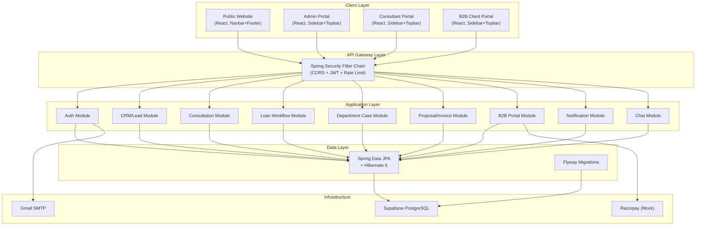

### 20.2 Component Architecture

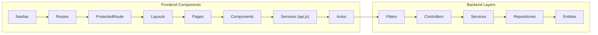

---

## 21. Project Execution Flow

### When a user clicks "Submit Inquiry" (Lead Capture):

1. **Component**: `LeadCaptureForm.jsx` (in `components/`)
2. **Event Handler**: `onClick` → `handleSubmit(e)`
3. **Validation**: Client-side field checks
4. **API Call**: `api.post('/leads/capture', formData)` — no auth header (public endpoint)
5. **Network**: HTTP POST to `localhost:5000/api/leads/capture`
6. **Security Filter**: `JwtAuthFilter` → no token → SecurityContext empty → proceed
7. **Authorization**: `@PreAuthorize("permitAll()")` on controller method → allowed
8. **Controller**: `LeadController.capture(LeadRequest request)`
9. **DTO Validation**: `@Valid` triggers Bean Validation
10. **Mapping**: `DtoMapper.toLead(request)` → Lead entity
11. **Service**: `LeadService.create(lead)`
12. **Sequence**: `SequenceGenerator.nextLeadId()` → "LEAD-001"
13. **Repository**: `LeadRepository.save(lead)`
14. **Hibernate**: `INSERT INTO leads (...) VALUES (...)`
15. **PostgreSQL**: Row committed
16. **Response**: `LeadResponse` DTO → `ResponseEntity.status(201)`
17. **Axios interceptor**: `normalizeData()` adds `_id` alias
18. **UI Update**: `toast.success(...)`, form reset

---

## 22. Interview Preparation Guide

### 22.1 Beginner Questions

**Q: What is React and why is it used here?**
> React is a JavaScript UI library for building component-based user interfaces. FinBridge uses React 19 to create a single-page application (SPA) with reusable components for dashboards, forms, and data displays across 5 different portals (admin, CRM, department, consultant, B2B).

**Q: What is Spring Boot and why is it used?**
> Spring Boot is a Java framework that provides auto-configuration for web applications. FinBridge uses it for its REST API backend because it integrates seamlessly with Spring Security (JWT auth), Spring Data JPA (database access), and provides production-ready features like health checks and CORS configuration.

**Q: What is a REST API?**
> REST (Representational State Transfer) is an architectural style for web services. FinBridge's backend exposes 18 REST controllers with endpoints like `POST /api/auth/login` and `GET /api/leads`. Each endpoint accepts/returns JSON and uses HTTP methods (GET, POST, PATCH, DELETE) to perform CRUD operations.

**Q: What is JWT and how does FinBridge use it?**
> JWT (JSON Web Token) is a compact token format for securely transmitting claims. FinBridge generates a JWT on login containing `{userId, email, role}`, signed with HMAC-SHA256. The frontend stores it in `sessionStorage` and sends it as `Authorization: Bearer <token>` on every API request. The backend's `JwtAuthFilter` validates it on each request.

### 22.2 Intermediate Questions

**Q: Why does FinBridge use two separate authentication systems?**
> The CRM auth (`AuthContext`) handles internal staff (admin, consultant, etc.) with tokens stored in both `sessionStorage` and `localStorage`. The B2B auth (`B2BAuthContext`) handles organization portal users with tokens only in `sessionStorage`. This separation ensures: (1) a B2B user's session doesn't interfere with a staff member logged into the same browser, (2) different token claims (CRM has role/department, B2B has organizationId), (3) independent session lifecycles.

**Q: Why separate Controller, Service, and Repository layers?**
> - **Controller**: HTTP concern — request/response mapping, validation, authorization annotations
> - **Service**: Business logic — orchestration, calculations, cross-entity operations, transaction management
> - **Repository**: Data access — JPA queries, database operations
> This separation allows unit testing each layer independently, and changing the database or API contract without affecting business logic.

**Q: Why use DTOs instead of returning entities directly?**
> DTOs prevent: (1) exposing sensitive fields like `password` to the API, (2) Hibernate lazy-loading issues when serializing outside a transaction, (3) circular references in entity relationships, (4) coupling the API contract to the database schema. `DtoMapper.java` centralizes all entity→DTO conversions.

**Q: How does the `normalizeData()` function in `api.js` work?**
> The frontend was originally written for a Node.js/MongoDB backend (which returns `_id` and bare arrays). When migrated to Spring Boot (which returns `id` and Spring `Page` objects), instead of updating 100+ call sites, a single Axios response interceptor: (1) unwraps `{ content: [...], totalElements, ... }` to just the array, (2) recursively adds `_id` as an alias for `id` on every object.

### 22.3 Advanced Questions

**Q: How does FinBridge handle multi-department workflows?**
> The `DeptCase` entity uses a JSONB `data` column for polymorphic storage. Each department (tax, investments, insurance, wealth) stores its own stage-specific data in this single column without requiring separate database schemas. The `stage` column drives the workflow state machine, while the JSONB payload carries department-specific fields. This avoids an explosion of tables and allows adding new departments without schema changes.

**Q: How is the loan workflow state machine implemented?**
> The `LoanCase` entity has a `stage` VARCHAR that progresses through 8 stages: `document_collection` → `eligibility` → `recommendation` → `client_review` → `bank_processing` → `disbursement` → `emi_tracking` → `closed`. The `LoanCaseService.patch()` method validates stage transitions. Child entities (`LoanCaseDocument`, `EmiScheduleItem`, `LoanCaseNote`) are eagerly loaded with the case and managed via `CascadeType.ALL`.

**Q: How would you scale FinBridge for production?**
> Current bottlenecks and solutions: (1) **Database**: Supabase has limited connections (pool max=5) → use PgBouncer or move to a managed PostgreSQL cluster, (2) **Session storage**: All tokens are in browser storage → add Redis for server-side session validation, (3) **File storage**: KYC documents are stored as base64 in PostgreSQL → move to S3/GCS with signed URLs, (4) **Payments**: Mock gateway → integrate real Razorpay with webhook verification, (5) **Search**: Full-table scans on leads → add Elasticsearch for lead/client search, (6) **Caching**: No caching layer → add Spring Cache with Redis for frequently-read data like consultants list.

**Q: What are the security concerns in the current implementation?**
> (1) JWT stored in `localStorage` is vulnerable to XSS — should use HttpOnly cookies, (2) `open-in-view: true` keeps Hibernate sessions open during serialization — could leak data if DTOs aren't carefully designed, (3) CSRF disabled — appropriate for token-based auth but requires all state-changing requests to carry the JWT, (4) No refresh token mechanism — users must re-login every 24h, (5) Base64 documents in PostgreSQL — large payloads increase DB size and query times.

---

## 23. Project Story Mode

> "A visitor discovers FinBridge through a Google search for financial advisory services. They land on the **Home page** — a stunning dark-themed website with a WebGL animated background (`ThreeBackground.jsx`), an animated counter showing 500+ clients served, and a clean navigation bar.
>
> They browse the **Services page** — valuation advisory, tax planning, wealth management — and decide to inquire. They scroll to the **Lead Capture Form** at the bottom of the Home page. They fill in their name, email, phone, service requirement ('Business Loan'), and budget ('₹50 Lakhs'). They click **Submit Inquiry**.
>
> Behind the scenes, the form data flies to `POST /api/leads/capture`. Spring Boot's `LeadController` catches it, the `LeadService` generates 'LEAD-001', and the lead is born in PostgreSQL with `status: 'new'`.
>
> The next morning, the **CRM Admin** logs into `/crm-admin/login`. Their dashboard lights up with a fresh lead. They click into it, review the details, make a phone call, and **qualify** the lead — updating its status to 'qualified' and score to 85. They then click **Send to Department** → 'Loans'.
>
> The **Loans Department Admin** opens their dashboard at `/department-admin/loans/dashboard`. A new lead appears in the queue. They review it, click **Send Fee Proposal**, which auto-creates a consultation booking. The lead status updates to 'proposal_sent'.
>
> The CRM Admin then **converts the lead to a client** — a new user account is created (`role: 'client'`), and a temporary password is generated. The lead status becomes 'won'.
>
> Meanwhile, the client's company registers on the **B2B Portal** at `/b2b/register`. They fill in company details (GSTIN, PAN, annual turnover), upload **KYC documents** (PAN card, GST certificate, bank statement), and submit service requests.
>
> The Department Admin **assigns a consultant**. The consultant sees the client on their dashboard, **schedules a meeting**, conducts the consultation, and starts the **Loan Workflow**.
>
> In the Loan Workflow's 8-stage pipeline, the consultant: collects and **verifies documents**, runs an **eligibility check** (credit score 750, DTI 0.35 — eligible!), crafts a **recommendation** (SBI, 8.5% interest, 240 months, ₹43,391/month EMI), and **sends it to the client**.
>
> The client reviews and **approves the recommendation**. The consultant submits to the bank, tracks the application, and upon approval, records the **disbursement** — which auto-generates a 20-year EMI schedule. Monthly payments are tracked in the system.
>
> A **proposal** is generated and sent for the advisory fee. The client **approves** it. An **invoice** is auto-generated with 18% GST. The client makes a **payment** through the B2B portal's Razorpay integration. The consultant marks the case as **closed**.
>
> Throughout this journey, **notifications** keep everyone informed, the **internal chat** system enables real-time communication between consultant and client, and the Super Admin's **analytics dashboard** tracks every metric: total leads, conversion rate, revenue, and department performance."

---

## 24. Bugs, Risks & Improvements

### 24.1 Identified Risks

| Category | Issue | Severity | Recommendation |
|---|---|---|---|
| **Security** | JWT in `localStorage` — XSS vulnerable | 🔴 High | Migrate to HttpOnly cookies |
| **Security** | No refresh token mechanism | 🟡 Medium | Implement token refresh endpoint |
| **Performance** | Base64 documents stored in PostgreSQL JSONB | 🔴 High | Move to S3/GCS with signed URLs |
| **Performance** | `open-in-view: true` (lazy loading in controllers) | 🟡 Medium | Migrate to explicit DTOs with `@EntityGraph` |
| **Scalability** | HikariCP pool limited to 5 connections | 🟡 Medium | Use connection pooling proxy (PgBouncer) |
| **Data** | `EAGER` fetch on `LoanCase` children (documents, EMI, notes) | 🟡 Medium | Switch to `LAZY` + explicit fetch queries |
| **Payment** | Mock payment gateway (no real Razorpay verification) | 🔴 High | Implement Razorpay order + signature verification |
| **Email** | SMTP optional — password resets fail silently if not configured | 🟡 Medium | Add SendGrid/SES as fallback |

### 24.2 Missing Features

| Feature | Priority | Notes |
|---|---|---|
| Real-time notifications (WebSocket) | 🟡 Medium | Currently polling-based |
| File upload via multipart (not base64) | 🔴 High | Current base64 approach doesn't scale |
| Audit logging | 🟡 Medium | Admin AuditLogs page exists but backend doesn't persist |
| Report PDF generation (server-side) | 🟡 Medium | Currently client-side only (`pdfGenerator.js`) |
| Two-factor authentication | 🟡 Medium | No 2FA implemented |
| Webhook-based payment confirmation | 🔴 High | Required for production Razorpay |

### 24.3 Architecture Improvements

| Improvement | Effort | Impact |
|---|---|---|
| Extract API gateway (Spring Cloud Gateway) | High | Centralized routing, rate limiting, circuit breaking |
| Add Redis caching layer | Medium | Reduce DB load for read-heavy endpoints |
| Implement CQRS for dashboard aggregations | High | Better read performance |
| Add integration tests | Medium | Catch regressions in multi-layer flows |
| Containerize with Docker Compose | Low | Consistent dev environment |
| Add CI/CD pipeline (GitHub Actions) | Low | Automated testing and deployment |

---

> **This document covers every file, function, component, API, database table, and workflow in the FinBridge project. You should now be able to explain any aspect of the project to a client, trainer, team lead, technical manager, interviewer, or viva panel.**
